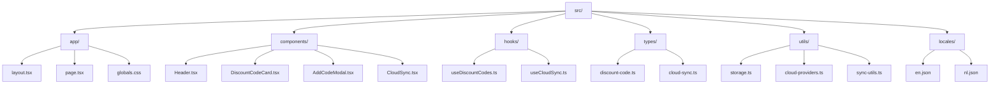

# KiloCode AI Project Guidelines

This project is a Progressive Web App (PWA) for managing discount codes, built with Next.js 15, TypeScript, and Tailwind CSS.

## Guidelines

- **Purpose:** The app allows users to store, manage, and organize discount codes with features such as filtering, offline support, and cloud synchronization.
- **Technology Stack:** Built with Next.js 15 (App Router), TypeScript, Tailwind CSS, Lucide React for icons, and i18next for multilingualism.
- **PWA Functionality:** The app is installable, works offline, and provides a native user experience.
- **Cloud Synchronization:** Supports synchronization via GitHub Gist and local files, with options for automatic synchronization and conflict resolution.
- **Local Storage:** All user data is stored locally in LocalStorage. No account registration is required, and no data is shared with third parties.
- **User Interface:** Clean, modern, and responsive design with dark/light mode support and accessibility.
- **Internationalization:** The app supports multiple languages, with translations managed via JSON files in `src/locales`.
- **Testing:** The project includes Jest tests for various components and functionalities.
- **Development:** Use `npm run dev` to start the development server with Turbopack for fast development.
- **Production:** Use `npm run build` and `npm start` for production builds.
- **Analytics:** The app provides an analytics dashboard with insights into discount code usage and savings.
- **Onboarding:** A built-in tutorial guides new users through the app's main features.

## Project Structure

## Testing Strategy

The project utilizes Jest for unit and integration testing. Tests are located in the `src/__tests__/` directory and cover various aspects of the application, including:

- **Component Testing:** Ensuring React components render correctly and behave as expected.
- **Hook Testing:** Verifying the logic and state management of custom React hooks.
- **Utility Function Testing:** Confirming the correctness of helper functions.
- **Translation Testing:** Validating the integrity and consistency of translation files.

To run tests, use the following commands:
- `npm test`: Runs all Jest tests.
- `npm test:translations`: Runs tests specifically for translation files.
- `npm test:all`: Runs all Jest tests, ESLint, and builds the project.
